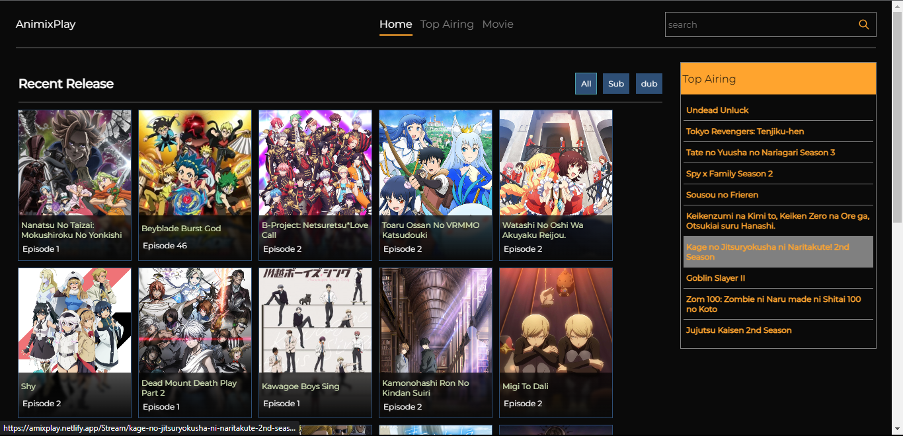
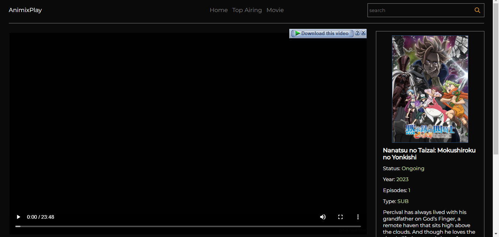

# AnimixPlay

Anime Streaming website

## Getting Started

``` bash
    git clone https://github.com/desto4q/AnimixPlay.git
```

### Prerequisites

- Node
- Pnpm

# Installing

Dowload and Unzip In Project folder<br>

### If using code

``` bash
    git clone https://github.com/desto4q/AnimixPlay.git
```

#### Then

``````
    Pnpm install
``````

``` vite
    Pnpm run dev
``````

## Screenshots






contact me at

    desto4q@gmail.com


## [Portfolio](https://illumi-code.netlify.app/)
